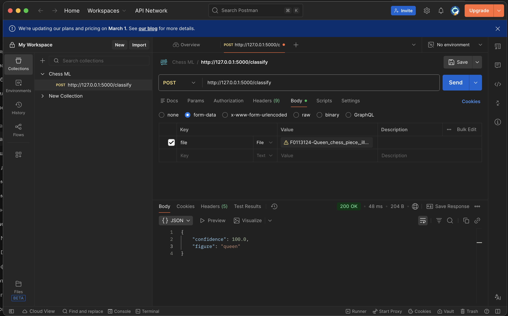
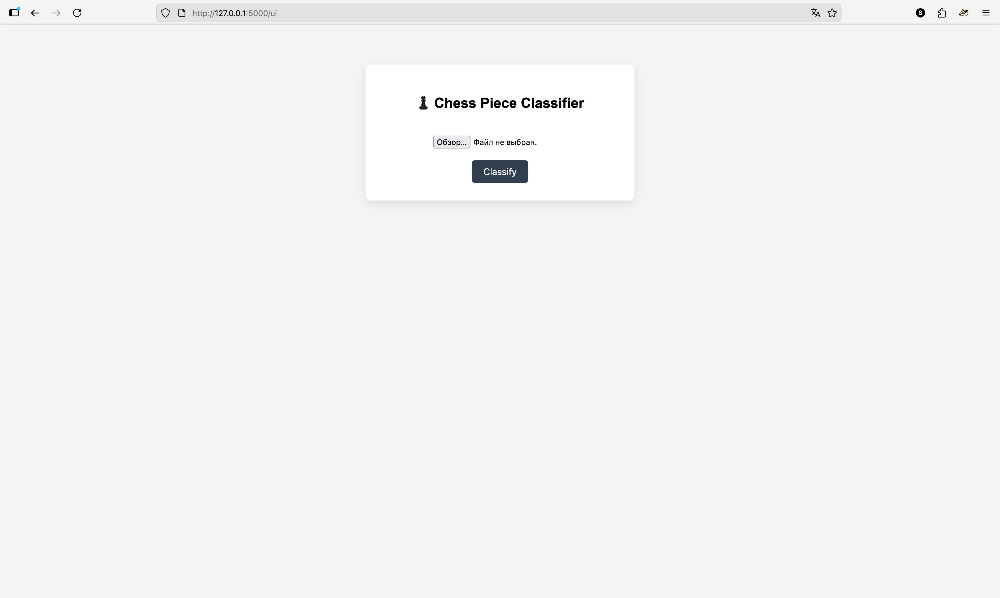
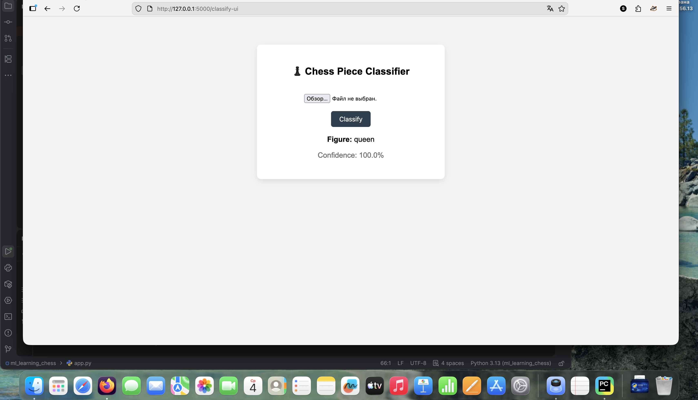

# ♟️ Chess Piece Image Classifier (Flask + TensorFlow)

This is a small ML-project on Python Flask, it takes a picture of the chess figure and returns what kind of figure this is it (pawn, rook, knight, bishop, queen, king) with probability of it.

The project use **before trained CNN-model TensorFlow** and REST API on Flask.

---

## 📦 Dataset & Training

- 📂 **Dataset:**  
  👉 *https://www.kaggle.com/datasets/niteshfre/chessman-image-dataset*

- 📓 **Google Colab (training notebook):**  
  👉 *https://colab.research.google.com/drive/13lb1e9h99Qg-h48vpv08AHnlY4CV_jT7#scrollTo=HfiOsa2i_m_W*

> ⚠️ Classis order in `classifier.py` **must match classis order during training**.

---

## 🧠 Support classes

Model recognize 6 chess figures:

- pawn
- rook
- knight
- bishop
- queen
- king

---

## 🏗️ Project architect

``` text
.
├── app.py # Flask API
├── classifier.py # Image preprocessing + inference
├── static/
│ ├── models/
│ │ └── chess_model.h5 # Trained model
│ └── uploads/ # Temp upload images
├── requirements.txt
└── README.md

```


---

## 🚀 Local start project

### 1 Clone repository
```bash
git clone <repo_url>
cd ml_learning_chess
```
### 2 Create and activate virtual env
```bash
python -m venv .venv
source .venv/bin/activate      # macOS / Linux
# .venv\Scripts\activate       # Windows
```
### 3 Install requirements
```bash
pip install -r requirements.txt
```
### 4 Start Flask server
```bash
python ap.py
```
🔌 Using API
POST /classify
📥 Request

Type: multipart/form-data

Field: file (image of chess figure)

### Example throw curl:
```bash
curl -X POST http://127.0.0.1:5000/classify \
  -F "file=@queen.png"
```
### 📤 Response:
```json
{
  "figure": "queen",
  "confidence": 92.47
}
```

## 🛠️ Technologies

Python 3.10+

Flask

TensorFlow / Keras

NumPy

## ⚠️ Important notes

Preprocessing during inference must math to preprocessing during training

Classes in CLASS_NAMES must be in the right order

API await for a one figure per request

## Example throw the Postman


## Example throw the browser

